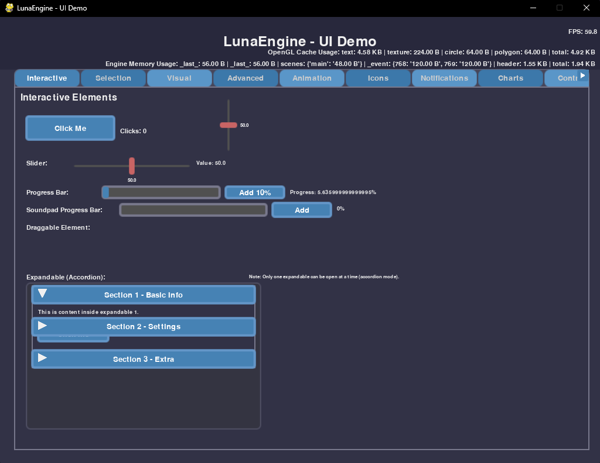
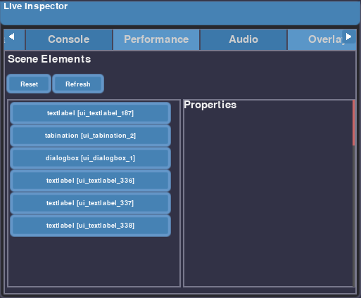
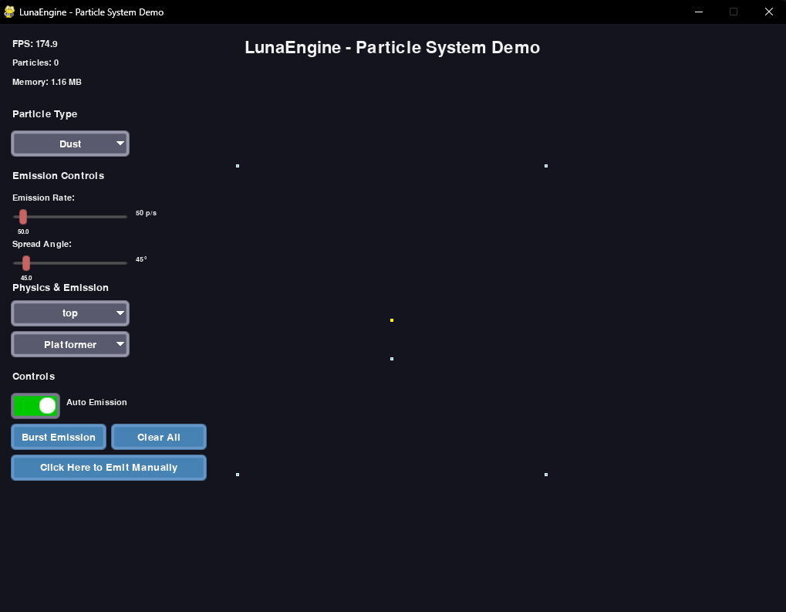
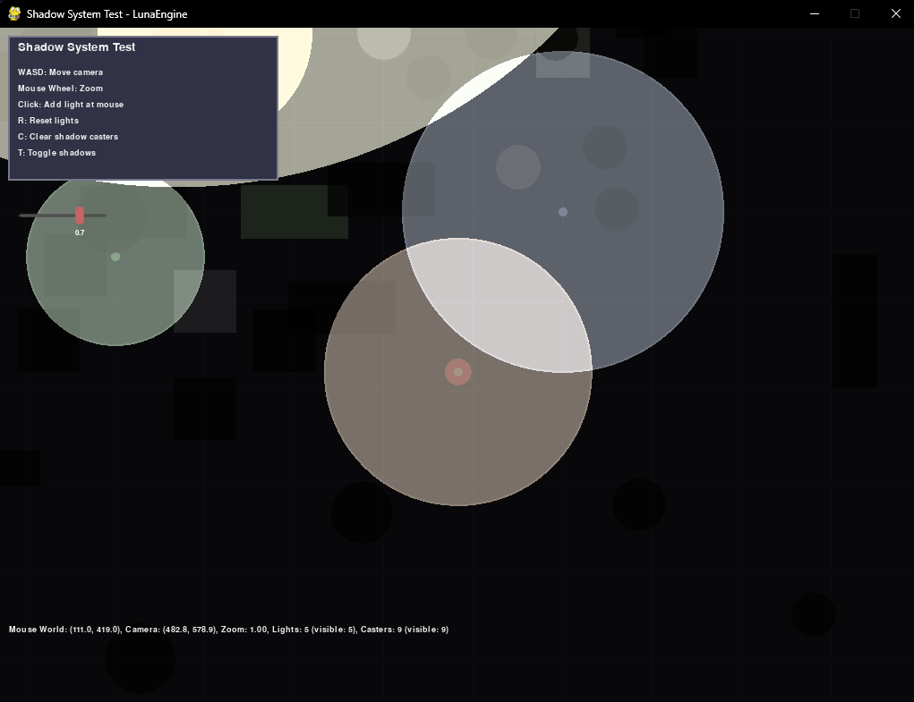

# LunaEngine 🚀

> "The only way to do great work is to love what you do." — Steve Jobs

## What is LunaEngine?

LunaEngine is a modern 2D game framework crafted entirely in Python, designed to streamline game development by abstracting the complexities of Pygame, OpenGL, and OpenAL. It provides a robust collection of built-in systems, including a sophisticated UI, advanced rendering capabilities, particle effects, dynamic lighting, audio management, networking, data storage, theming, debugging tools, and numerous utilities. Born from a passion for game creation, LunaEngine empowers developers to build engaging 2D experiences with elegance and efficiency.

## Why LunaEngine?

Developing a game from scratch can be an arduous journey, often requiring developers to reinvent the wheel for fundamental functionalities. LunaEngine emerges as a powerful alternative, offering a comprehensive suite of tools that significantly accelerate the development process while maintaining high performance and flexibility. By leveraging OpenGL for hardware-accelerated graphics and OpenAL for immersive audio, LunaEngine ensures your games run smoothly and sound spectacular.

Key advantages of LunaEngine include:

- **OpenGL & OpenAL Integration**: Harness the power of hardware acceleration for stunning visuals and rich, spatial audio without deep knowledge of low-level APIs.

- **Advanced UI System**: Create intuitive and responsive user interfaces with a system inspired by modern design principles, offering a wide array of customizable elements and robust event handling.

- **Dynamic Theming**: Effortlessly switch the look and feel of your game with a rich collection of pre-built themes, ensuring a consistent and polished aesthetic.

- **Persistent Storage**: Seamlessly manage game data and player progress with integrated storage solutions.

- **LiveInspector**: A powerful debugging tool that allows real-time inspection and modification of game objects and properties, drastically reducing development time.

- **RichText Rendering**: Implement complex text layouts and styles with ease, enhancing in-game narratives and informational displays.

- **Texture Atlas Management**: Optimize rendering performance by efficiently managing and packing textures into atlases.

- **Camera System**: Implement flexible 2D camera controls, including zooming, panning, and parallax effects, to create dynamic viewpoints.

- **Particle System**: Generate stunning visual effects, from explosions to environmental ambiance, with a highly optimized and customizable particle system.

- **Dynamic Lighting**: Bring your scenes to life with realistic dynamic lighting and shadow effects, adding depth and atmosphere.

- **Notifications**: Implement in-game notification systems to provide timely feedback to players.

- **Charts**: Visualize in-game data or debugging information with integrated charting capabilities.

- **Controller Support**: Ensure broad accessibility with robust support for various game controllers.

- **Performance Tools**: Monitor and optimize your game's performance with built-in profiling and diagnostic tools.

## Features

LunaEngine boasts a rich set of features designed to cover every aspect of 2D game development. Below is a detailed overview of its core capabilities:

| Feature | Description | Status | Note |
| --- | --- | --- | --- |
| **Advanced UI System** | Create complex and interactive user interfaces with ease, inspired by Roblox Studio. | ✅ Functional | Highly customizable and extensible. |
| **OpenGL Rendering** | Hardware-accelerated graphics pipeline for smooth and efficient 2D rendering. | ✅ Functional | Requires OpenGL 3.3+ for optimal performance. |
| **OpenAL Audio** | Immersive spatial audio capabilities for realistic soundscapes and effects. | ✅ Functional | Supports WAV, OGG, and MP3 formats. |
| **Dynamic Theming** | Apply pre-built or custom themes to your UI elements for a consistent look. | ✅ Functional | 58+ themes available out-of-the-box. |
| **Persistent Storage** | Save and load game data effortlessly, managing player progress and configurations. | ✅ Functional | Simple API for data serialization. |
| **LiveInspector** | Real-time debugging tool to inspect and modify game state during runtime. | ✅ Functional | Accelerates debugging and iteration. |
| **RichText Rendering** | Advanced text rendering with support for various fonts, styles, and formatting. | ✅ Functional | Enhances in-game text presentation. |
| **Texture Atlas** | Efficiently manage and render textures using atlases to reduce draw calls. | ✅ Functional | Improves rendering performance. |
| **Camera System** | Flexible 2D camera for scrolling, zooming, and tracking game entities. | ✅ Functional | Simplified camera controls. |
| **Particle System** | Create dynamic and visually appealing particle effects for various scenarios. | ✅ Functional | Optimized for performance, but can be intensive. |
| **Dynamic Lighting** | Implement realistic lighting and shadow effects to enhance scene ambiance. | ✅ Functional | Continuous optimization for performance. |
| **Notifications** | Display in-game messages and alerts to inform players. | ✅ Functional | Customizable notification styles. |
| **Charts** | Integrate data visualization directly into your game or debugging tools. | ✅ Functional | Useful for performance monitoring. |
| **Controller Support** | Native support for game controllers, enhancing player experience. | ✅ Functional | Broad compatibility with various devices. |
| **Performance Tools** | Built-in tools for monitoring FPS, resource usage, and hardware information. | ✅ Functional | Aids in game optimization. |
| **Modular Architecture** | Well-organized codebase allowing for easy extension and customization. | ✅ Functional | Designed for maintainability and scalability. |
| **Post-processing Filters** | Apply visual effects like Blur, Neon, and Pixelate to your game scenes. | ✅ Functional | Can be GPU/CPU intensive depending on usage. |
| **Scene Management** | Organize game logic into distinct scenes with smooth transitions. | ✅ Functional | Inspired by Godot's scene organization. |

## Screenshots

LunaEngine in action! Here are some glimpses of what you can create:

{:height=480px width=720px} - *A demonstration of LunaEngine's versatile UI system.*

{:height=480px width=720px} - *Inspecting game objects in real-time with the LiveInspector.*

{:height=480px width=720px} - *Dynamic particle effects adding visual flair to a scene.*

{:height=480px width=720px} - *A scene illuminated with LunaEngine's dynamic lighting system.*

## Installation

Getting started with LunaEngine is straightforward. Follow these steps to set up your development environment:

### Prerequisites

- **Python**: Version 3.9 or newer is recommended. (Not tested on older versions).

- **OpenGL**: Requires OpenGL 3.3+ compatible hardware and drivers. OpenGL is activated by default.

- **Operating Systems**: Officially supported on Windows and Linux. macOS is not currently supported.

### Install from PyPI

The easiest way to install LunaEngine is via pip:

```bash
pip install lunaengine
```

### Install from TestPyPI (for pre-releases)

To access the latest pre-release versions, you can install from TestPyPI:

```bash
pip install -i https://test.pypi.org/simple/ lunaengine
```

### Core Dependencies

LunaEngine relies on the following core Python packages:

```bash
pygame>=2.5.0
numpy>=1.21.0
PyOpenGL>=3.1.0
PyOpenGL-accelerate>=3.1.0
PyOpenAL
```

### Development Tools (Optional )

For contributing to LunaEngine or for advanced development workflows, these tools are recommended:

```bash
black>=22.0.0
flake8>=4.0.0
pytest>=7.0.0
setuptools>=65.0.0
wheel>=0.37.0
twine>=4.0.0
```

## Quick Example

Let's dive into a simple example to see LunaEngine in action. This code snippet demonstrates how to set up a basic game window, create a UI button, and handle an event.

```python
from lunaengine.core import LunaEngine, Scene
from lunaengine.ui import Button, Label
from lunaengine.graphics import Color

class MyGame(Scene):
    def __init__(self, engine: LunaEngine):
        super().__init__(engine)
        self.set_background_color(Color.DARK_GRAY)

        # Create a button
        self.my_button = Button(
            text="Click Me!",
            x=350,
            y=250,
            width=100,
            height=50,
            on_click=self.on_button_click
        )
        self.add_ui_element(self.my_button)

        # Create a label to display messages
        self.message_label = Label(
            text="",
            x=300,
            y=350,
            width=200,
            height=30,
            font_size=24,
            color=Color.WHITE
        )
        self.add_ui_element(self.message_label)

    def on_button_click(self):
        self.message_label.set_text("Button Clicked!")
        print("Button was clicked!")

    def update(self, dt):
        # Game logic updates here
        pass

    def render(self, renderer):
        # Custom drawing logic here (e.g., drawing game objects)
        pass

if __name__ == "__main__":
    engine = LunaEngine("My Demo", 1024, 720)

    engine.add_scene('scene_name', MyGame)
    engine.set_scene('scene_name')

    engine.run()
```

To run this example:

1. Save the code as `my_game.py`.

1. Ensure LunaEngine is installed (`pip install lunaengine`).

1. Run from your terminal: `python my_game.py`

## Engine Structure

LunaEngine is built with a modular and organized architecture to ensure maintainability, scalability, and ease of use. The project is divided into several core directories, each responsible for a specific set of functionalities:

| Directory | Description | Key Responsibilities |
| --- | --- | --- |
| `backend/` | Low-level system interactions | OpenGL, OpenAL, networking, controller input, hardware communication. |
| `core/` | The engine's central nervous system | Main loop, window management, scene handling, rendering pipeline, event management. |
| `graphics/` | Visual rendering and effects | Camera system, particle effects, dynamic lights, shadows, sprite sheets, GLSL shaders, post-processing filters. |
| `ui/` | User interface components | Buttons, labels, text boxes, dropdowns, scrolling frames, theming, animations, notifications, tooltips, layout management. |
| `utils/` | General utility functions | Math helpers, threading, performance monitoring, timers, image conversion. |
| `misc/` | Miscellaneous tools and assets | Debugging tools, built-in icon sets, internal development assets. |
| `tools/` | Internal development scripts | Code statistics, asset helpers (primarily for internal use, not end-users). |

This clear separation of concerns allows developers to focus on specific aspects of their game without getting lost in a monolithic codebase.

## Current Statistics

LunaEngine is a continuously evolving project, and its growth is reflected in its codebase and feature set:

- **Files**: Approximately 149 files

- **Lines of Code (LOC)**: Over 16,000 lines of Python code

- **Themes**: 58+ built-in themes for UI customization

- **UI Elements**: 27 distinct UI elements ready for use

- **Post-processing Filters**: A growing collection of visual filters (e.g., Blur, Neon, Pixelate)

- **Supported Audio Formats**: WAV, OGG, MP3

These statistics highlight the comprehensive nature of LunaEngine and its commitment to providing a rich development experience.

## Main Systems

LunaEngine integrates several powerful systems that form the backbone of its capabilities. Each system is designed to be robust, flexible, and easy to use:

### UI (User Interface)

The UI system in LunaEngine is a cornerstone of its design, offering a highly flexible and intuitive way to build in-game interfaces. Inspired by the declarative nature of web development (HTML/CSS) and the component-based approach of platforms like Roblox Studio, it provides a rich set of elements, robust event handling, and dynamic theming capabilities. This allows developers to create everything from simple buttons to complex inventory screens with minimal effort.

### LiveInspector

The LiveInspector is an indispensable debugging and development tool. It allows developers to inspect and modify game objects, properties, and the overall game state in real-time, directly within the running application. This immediate feedback loop significantly accelerates the debugging process, helps in fine-tuning game mechanics, and provides deep insights into the engine's internal workings.

### Storage

LunaEngine's storage system provides a straightforward and efficient way to handle persistent data. Whether it's saving player progress, game settings, or custom configurations, the storage system ensures that data can be easily serialized, stored, and retrieved. This abstraction simplifies data management, allowing developers to focus on game logic rather than low-level file operations.

### Atlas (Texture Atlas Management)

Efficient texture management is crucial for optimal rendering performance in 2D games. The Atlas system in LunaEngine automatically packs multiple smaller textures into larger texture atlases. This reduces the number of draw calls required by the GPU, leading to smoother animations and faster rendering, especially in games with many visual assets.

### RichText

Beyond basic text display, LunaEngine's RichText rendering capabilities allow for sophisticated text presentation. Developers can apply various fonts, colors, styles (bold, italic), and even embed inline images or interactive elements within text. This is invaluable for creating engaging dialogues, informative tooltips, and visually rich in-game documents.

### Audio

The audio system, powered by OpenAL, provides comprehensive sound management for LunaEngine. It supports various audio formats (WAV, OGG, MP3) and offers features like spatial audio, volume control, looping, and sound effects. This enables developers to create immersive auditory experiences that complement their game's visuals and gameplay.

### Graphics

The graphics system is at the heart of LunaEngine's visual prowess. Leveraging OpenGL, it handles everything from basic sprite rendering to advanced visual effects. This includes managing shaders, rendering pipelines, post-processing filters, and ensuring hardware-accelerated performance across supported platforms.

### Particles

LunaEngine's particle system is a highly optimized and flexible tool for creating dynamic visual effects. From subtle environmental effects like falling leaves to explosive combat animations, the system allows for extensive customization of particle behavior, appearance, and emission. While powerful, developers are encouraged to optimize particle usage for best performance.

### Lighting

Adding depth and atmosphere to 2D scenes is made possible with LunaEngine's dynamic lighting system. It supports various light sources, shadow casting, and ambient lighting, allowing for realistic illumination that reacts to game events and character movements. This system is continuously being optimized to balance visual quality with performance.

### Themes

The theming system provides a powerful way to control the aesthetic of your game's UI. With over 58 built-in themes and the ability to create custom ones, developers can easily change the entire look and feel of their application. This promotes consistency in design and allows for rapid prototyping of different visual styles.

### Networking

While still under development, the networking system aims to provide robust and easy-to-use functionalities for implementing multiplayer features, online leaderboards, or other network-dependent game mechanics. This will enable developers to create connected experiences within their LunaEngine games.

### Performance Monitor

Optimizing game performance is a continuous process. The built-in performance monitor provides real-time insights into FPS, CPU/GPU usage, memory consumption, and other critical metrics. This data is invaluable for identifying bottlenecks and ensuring that games run smoothly across target hardware.

### Charts

For developers who need to visualize data within their games or debugging tools, LunaEngine offers integrated charting capabilities. This can be used to display anything from player statistics to complex physics simulations, providing clear and concise visual representations of information.

### Controller Support

Ensuring a broad and accessible gaming experience, LunaEngine includes comprehensive controller support. This allows players to use their preferred gamepads and joysticks, providing a more intuitive and engaging way to interact with your games.

## Documentation

Comprehensive documentation is key to a thriving open-source project. Beyond this README, LunaEngine offers several resources to help you learn and master the framework:

- **Documentation Website**: The official documentation website provides in-depth guides, API references, and tutorials. [Visit the Docs](https://mrjuaumbr.github.io/LunaEngine/)

- **Examples**: Explore a variety of code examples in the [GitHub examples directory](https://github.com/MrJuaumBR/LunaEngine/tree/main/examples) to see how different features are implemented.

- **Lessons**: Step-by-step lessons are available to guide you through core concepts and advanced techniques. [Start Learning](./lessons.md)

- **LunaEngine-Games**: Discover more complex projects and full game implementations in the [LunaEngine-Games repository](https://github.com/MrJuaumBR/LunaEngine-Games).

- **Discord Community**: Join our vibrant community on [Discord](https://discord.com/invite/fb84sHDX7R) to ask questions, share your projects, and connect with other LunaEngine developers.

## AI Support

Modern AI models can be powerful allies in your development journey with LunaEngine, especially those equipped with web search capabilities. While AI models have knowledge cutoffs, you can effectively leverage them by providing the right context:

To get accurate and up-to-date assistance from AI regarding LunaEngine:

1. **Use an AI model with web search/browsing**: Ensure your chosen AI (e.g., DeepSeek, Grok in expert mode) can access external web resources.

1. **Provide key links**: Explicitly share the official [LunaEngine GitHub repository](https://github.com/MrJuaumBR/LunaEngine) and the [LunaEngine official documentation](https://mrjuaumbr.github.io/LunaEngine/) with the AI.

By doing so, AI models can effectively understand LunaEngine's code structure, explain its features, and even assist in generating code snippets or troubleshooting issues. It's like having an intelligent co-pilot for your game development!

## FAQ

Here are some frequently asked questions about LunaEngine:

**Q: Why does LunaEngine primarily use OpenGL?**

A: LunaEngine leverages OpenGL for hardware-accelerated rendering, which provides significantly better performance and visual capabilities compared to software-based renderers like Pygame's default. This choice allows for more complex graphics, dynamic lighting, and advanced post-processing effects, pushing the boundaries of what's possible in a 2D Python game framework.

**Q: Will LunaEngine support 3D development in the future?**

A: Currently, LunaEngine is exclusively focused on 2D game development. The design philosophy centers around providing a robust and optimized framework for 2D experiences. There are no immediate plans to integrate 3D support, as it would fundamentally change the project's scope and complexity.

**Q: Is macOS supported by LunaEngine?**

A: At present, LunaEngine officially supports Windows and Linux operating systems. While it might run on macOS in some configurations, it is not actively tested or maintained for this platform. The development focus remains on Windows and Linux to ensure a stable and optimized experience for its primary user base.

**Q: Can I use LunaEngine for commercial game projects?**

A: Absolutely! LunaEngine is released under a permissive license, allowing you to use it for both personal and commercial projects without any restrictions. Feel free to create, publish, and even monetize your games built with LunaEngine. We'd love to see what you create!

**Q: How can I contribute to LunaEngine?**

A: We welcome contributions from the community! Whether it's reporting bugs, suggesting features, improving documentation, or submitting code, your help is invaluable. Please refer to the [Contributing](#contributing) section for detailed guidelines on how to get involved.

## Roadmap

LunaEngine is a project with a clear vision for continuous improvement and expansion. Here's a glimpse into our future plans and ongoing developments:

- **Networking System**: Implement a robust and easy-to-use networking module for multiplayer games and online features.

- **Advanced Physics Engine**: Integrate a more sophisticated 2D physics engine for realistic interactions.

- **Enhanced Tooling**: Develop more integrated development tools to streamline workflows.

- **Cross-Platform Compatibility**: Explore broader platform support while maintaining performance.

- **Community Tutorials**: Expand the collection of tutorials and examples based on community feedback.

- **Performance Optimizations**: Continuous efforts to refine the engine's performance across all systems.

This roadmap is dynamic and evolves with community input and technological advancements. We're excited to build the future of LunaEngine together!

## Contributing

We believe in the power of community and welcome contributions to LunaEngine! Your input, whether it's code, documentation, bug reports, or feature suggestions, helps make the engine better for everyone. Here's how you can get involved:

1. **Report Bugs**: If you encounter any issues, please open a detailed bug report on our [GitHub Issues page](https://github.com/MrJuaumBR/LunaEngine/issues).

1. **Suggest Features**: Have an idea for a new feature or improvement? Share it with us by opening a feature request on GitHub.

1. **Improve Documentation**: Help us make the documentation even clearer and more comprehensive. Typos, clarifications, or new examples are always welcome.

1. **Submit Code**: If you'd like to contribute code, please fork the repository, create a new branch, and submit a pull request. Ensure your code adheres to our coding standards and includes appropriate tests.

1. **Join the Community**: Engage with other developers on our [Discord server](https://discord.com/invite/fb84sHDX7R) to discuss ideas and get support.

Before contributing code, please review our `CONTRIBUTING.md` (if available) for detailed guidelines. We appreciate your efforts in making LunaEngine a fantastic resource for 2D game development!

## License

LunaEngine is released under the [MIT License](https://opensource.org/licenses/MIT). This means you are free to use, modify, and distribute the engine for both commercial and non-commercial purposes, provided that the original copyright notice and license are included in all copies or substantial portions of the software.

## Final Message

Hey there, fellow game dev! It's been an incredible journey building LunaEngine, pouring my heart and soul into creating something truly special. This isn't just a piece of software; it's a labor of love, a toolkit designed to bring your 2D game ideas to life with a dash of Python magic and a whole lot of fun. I genuinely believe in the power of open-source and the creativity it unleashes. So, go forth, experiment, build amazing games, and most importantly, have a blast doing it! Your imagination is the only limit. Let's make some awesome games together! ✨

---

<picture>
<source
    media="(prefers-color-scheme: dark)"
    srcset="https://api.star-history.com/svg?repos=MrJuaumBR/LunaEngine&type=Date&theme=dark"
  />
  <source
    media="(prefers-color-scheme: light )"
    srcset="https://api.star-history.com/svg?repos=MrJuaumBR/LunaEngine&type=Date"
  />
  
</picture>